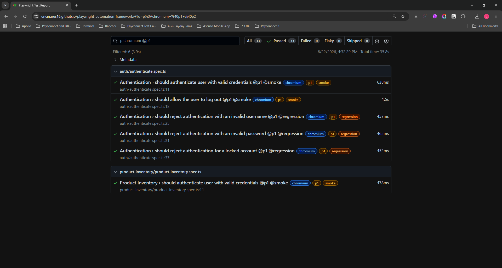

# SauceDemo Test Automation Framework

Automation testing framework for the **SauceDemo** website using **Playwright**, **TypeScript**, and **Page Object Model (POM)**.

The framework is designed for scalable UI automation with reusable page classes, maintainable test cases, and CI/CD execution through GitHub Actions.


| Technology | Purpose |
|---|---|
| Playwright | Browser automation framework |
| TypeScript | Programming language |
| Node.js | Runtime environment |
| Playwright Test Runner | Test execution framework |
| Page Object Model | Test architecture pattern |
| GitHub Actions | CI/CD automation |

### Test Execution Report

[Playwright HTML Report](https://encinares16.github.io/playwright-automation-framework/)



## 🌐 Application Under Test

**SauceDemo**

https://www.saucedemo.com/

Test scenarios cover common e-commerce workflows:

- User authentication
- Product listing validation 
- Product sorting 
- Add/remove cart items
- Checkout flow
- Order completion

## Project Structure

```text
playwright-automation/
├── .github/
│   └── workflows/
├── src/
|   ├── assertions/
|   ├── components/
|   ├── fixtures/
|   ├── flows/
|   ├── interfaces/
|   ├── pages/
|   ├── test-data/
|   ├── types/
│   └── utils/
├── tests/
│   └── *.spec.ts
├── playwright.config.ts
├── package.json
├── tsconfig.json
└── README.md
```

## Prerequisites

Ensure the following are installed:

* Node.js
* npm or yarn
* Git

Verify installation:

```bash
node --version
npm --version
git --version
```

## Installation

Clone the repository:

```bash
git clone <repository-url>
cd playwright-automation
```

Install dependencies:

```bash
npm install
```

Install Playwright browsers:

```bash
npx playwright install
```

## Environment Configuration

Create a `.env` file in the project root:

```env
BASE_URL=https://your-application-url.com
USERNAME=testuser
PASSWORD=testpassword
```

Example environment loading:

```typescript
import dotenv from 'dotenv';
dotenv.config();
```

## Running Tests

### Run All Tests

```bash
npx playwright test or npm run test
```

### Run Specific Test File

```bash
npx playwright test tests/login.spec.ts
```

### Run Tests in Headed Mode

```bash
npx playwright test --headed or npm run test:ui
```

### Run Tests on Specific Browser

```bash
npx playwright test --project=chromium
npx playwright test --project=firefox
npx playwright test --project=webkit
```

### Run Tests with Debug Mode

```bash
npx playwright test --debug
```